# Journese

Journese is your all-in-one travel companion, enabling you to post trips, connect with fellow travelers, chat, discover new places, and schedule shared journeys, all within a single mobile application

## Table of Contents
* [Features](#features)
* [Screenshot](#screenshot)

## Features
- **Travel Together:** Users can find and connect with others who have similar travel plans, making travel more enjoyable and less solitary.
- **Social functionality:** Users can upload posts about their trips, allowing others to see and join. Moreover, users can access templates from completed trips. They also have the ability to make friends and chat with others.
- **Place search:** Journese can recommend places to users based on their ratings and favorites using ML model. This makes finding places for a trip easier and reduces the likelihood of missing out on places they might enjoy
- **Trip scheduling:** Plan and schedule your trips right within the app, keeping your travel plans organized.
- **Advertisement:** User can post their advertisements for promote their places or services. After the ad is paid, it will be last for 5 days.
## Screenshot
You can look for all the preview pics in the preview pics folder.
Here are some screenshots of the app
- **Auth:**

  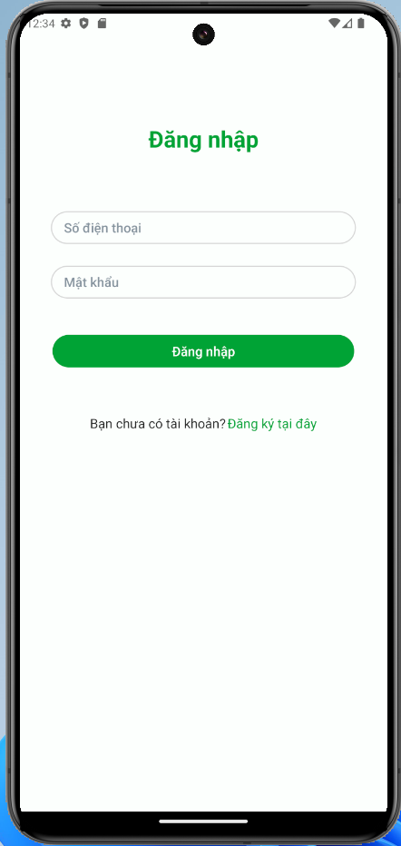
  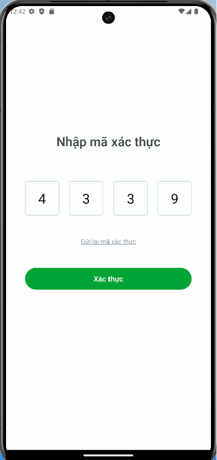
  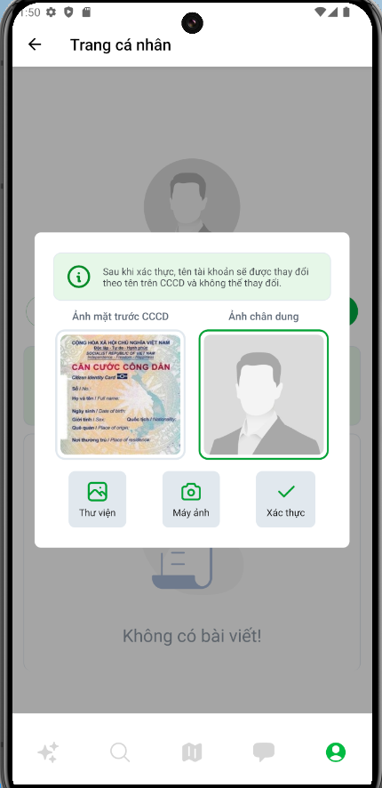 
  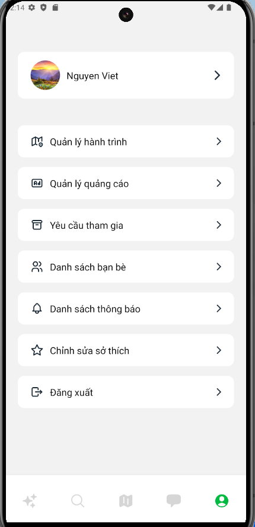

- **Place discovery:**

  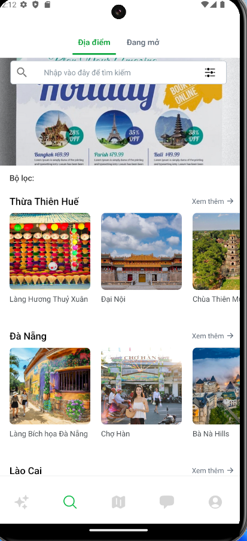
  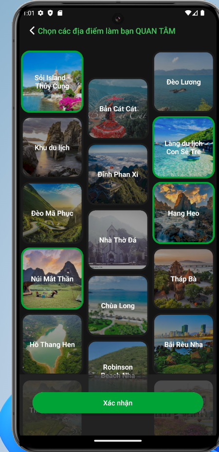
  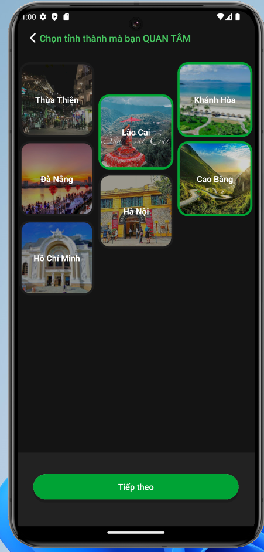 
  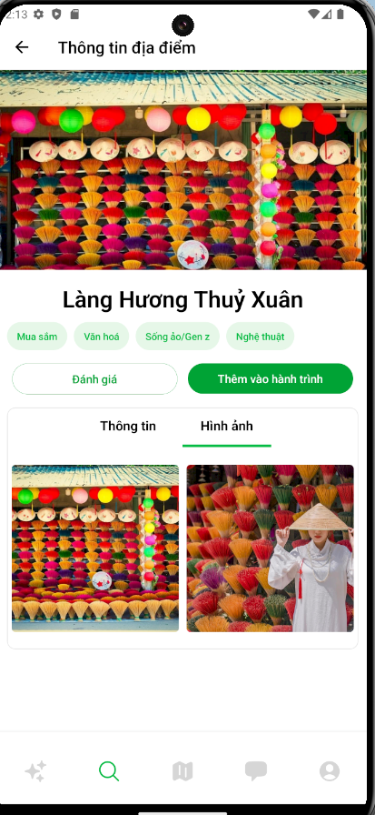

- **Social functionality:**

  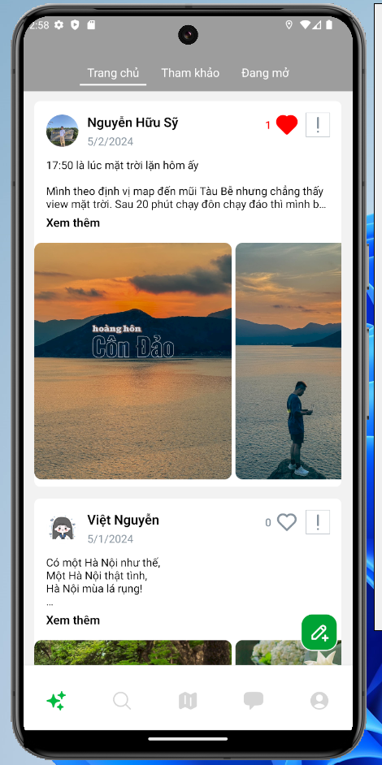
  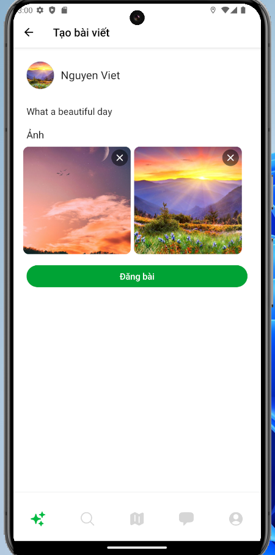
  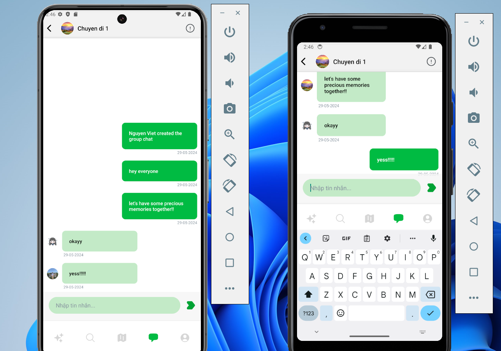

- **Travel together:**

  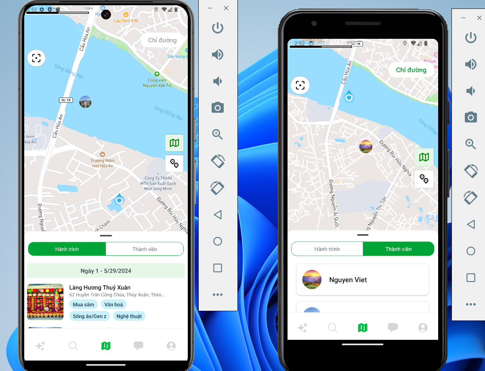
   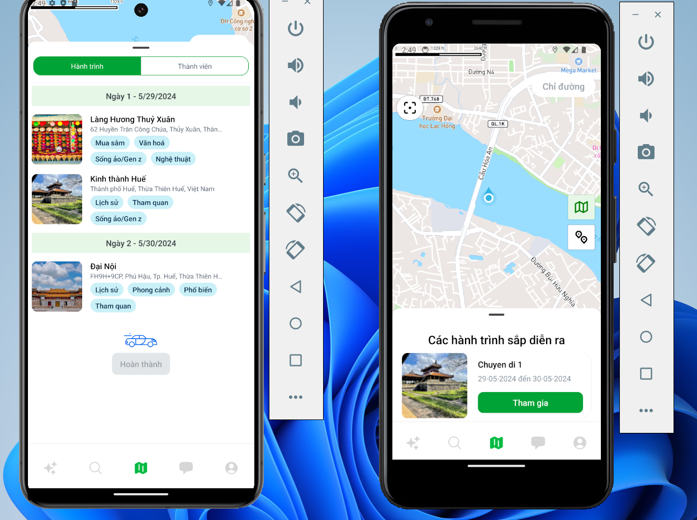

  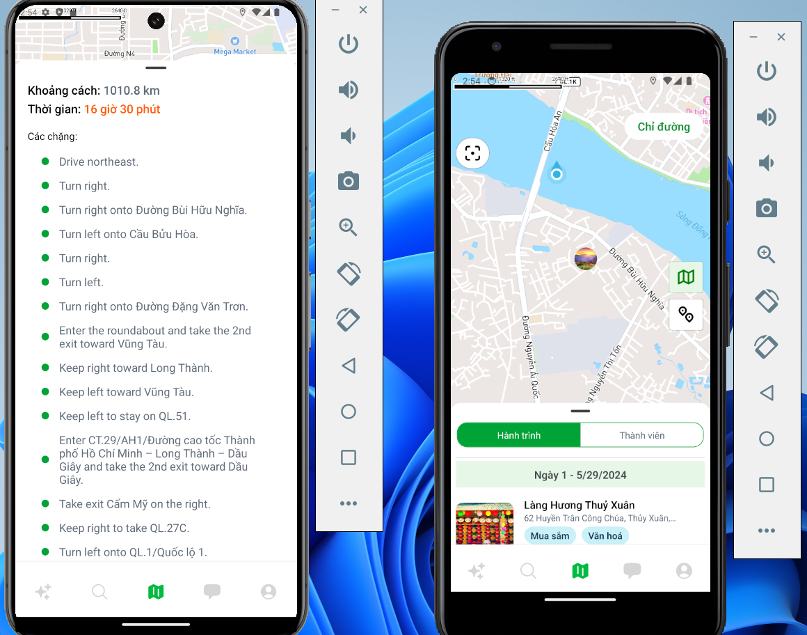
   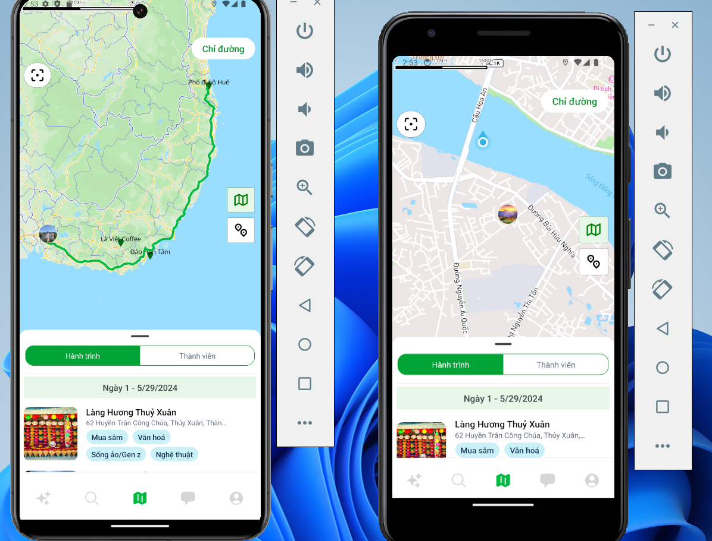

 